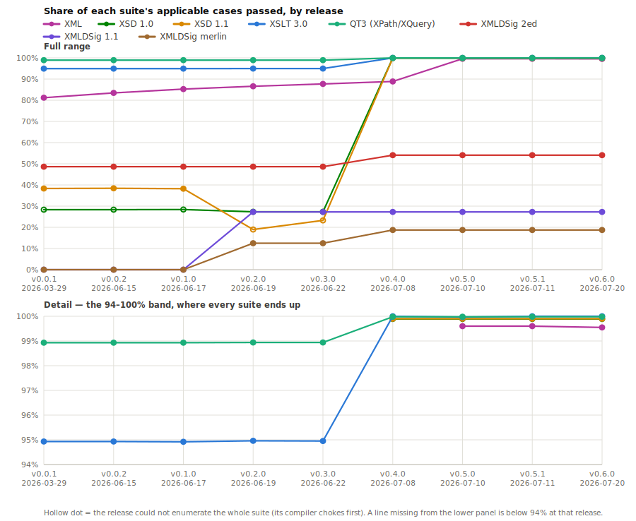

# W3C conformance across releases

<!-- GENERATED by tools/conformance-timeline/aggregate.py -- do not edit by hand. -->

Every tagged release measured **unmodified** against *today's* W3C suites (reference: `v0.5.1`). See [tools/conformance-timeline](tools/conformance-timeline/README.md) for the method.

## Score by release

| Release | Date | XML 1.0/1.1 | XSD 1.0 | XSD 1.1 | XSLT 3.0 | XPath/XQuery (QT3) |
|---|---|---:|---:|---:|---:|---:|
| `v0.0.1` | 2026-03-29 | 81.2% ✗8 ⚠8 | 28.3% | 38.3% ⚠1 | 94.9% ⊘481 | 98.9% ⊘17 ⚠4 |
| `v0.0.2` | 2026-06-15 | 83.5% ✗20 ⚠8 | 28.3% | 38.4% ⚠1 | 94.9% ✗1 ⊘481 | 98.9% ⊘17 ⚠4 |
| `v0.1.0` | 2026-06-17 | 85.3% ✗20 ⚠8 | 28.4% | 38.2% ⚠1 | 94.9% ✗1 ⊘481 | 98.9% ⊘17 ⚠4 |
| `v0.2.0` | 2026-06-19 | 86.6% ✗12 ⚠8 | 27.3% | 19.0% | 95.0% ⊘481 | 98.9% ⊘17 ⚠4 |
| `v0.3.0` | 2026-06-22 | 87.7% ⚠8 | 27.3% | 23.3% | 95.0% ⊘481 | 98.9% ⊘18 ⚠4 |
| `v0.4.0` | 2026-07-08 | 88.9% ⚠8 | 99.9% ⚠16 | 99.90% ⚠1 | **100%** | 99.98% ⚠4 |
| `v0.5.0` | 2026-07-10 | 99.6% ⚠8 | 99.9% ⚠16 | 99.90% ⚠1 | 99.97% | 99.98% ⚠4 |
| `v0.5.1` | 2026-07-11 | 99.6% ⚠8 | 99.9% ⚠16 | 99.90% ⚠1 | **100%** | 99.98% ⚠4 |

✗ hang/OOM crasher · ⊘ in-scope case never run · ⚠ documented expected failure — **all three count as not-passing**.

## How a score is computed

The denominator is the set of cases the reference release actually **runs**: today's suite minus the cases the harness skips as *inapplicable* (wrong XML edition, XML 1.1 when helium targets 1.0, dependency gates). Those are not failures and never could be, so charging them to a release would understate it.

| Suite | Applicable | Excluded as inapplicable |
|---|---:|---:|
| XML 1.0/1.1 | 2,001 | 584 |
| XSD 1.0 | 14,399 | 0 |
| XSD 1.1 | 1,049 | 0 |
| XSLT 3.0 | 12,827 | 300 |
| XPath/XQuery (QT3) | 22,328 | 141 |

Everything else counts against the release: cases it fails, cases it **cannot enumerate** (its compiler chokes before the harness can run them — a hollow dot on the chart), cases it **skips that the reference runs**, cases that **hang or exhaust its memory**, and documented **expected failures**.

## Full counts

### XML 1.0/1.1 — 2,001 applicable cases

| Release | Pass | Not passing | ⚠ xfail | ⊘ unrun | ✗ crash | Not enumerated | Score |
|---|---:|---:|---:|---:|---:|---:|---:|
| `v0.0.1` | 1,625 | 376 | 8 | — | 8 | — | 81.2% |
| `v0.0.2` | 1,670 | 331 | 8 | — | 20 | — | 83.5% |
| `v0.1.0` | 1,706 | 295 | 8 | — | 20 | — | 85.3% |
| `v0.2.0` | 1,733 | 268 | 8 | — | 12 | — | 86.6% |
| `v0.3.0` | 1,755 | 246 | 8 | — | — | — | 87.7% |
| `v0.4.0` | 1,778 | 223 | 8 | — | — | — | 88.9% |
| `v0.5.0` | 1,993 | 8 | 8 | — | — | — | 99.6% |
| `v0.5.1` | 1,993 | 8 | 8 | — | — | — | 99.6% |

### XSD 1.0 — 14,399 applicable cases

| Release | Pass | Not passing | ⚠ xfail | ⊘ unrun | ✗ crash | Not enumerated | Score |
|---|---:|---:|---:|---:|---:|---:|---:|
| `v0.0.1` | 4,078 | 10,321 | — | — | — | 9746 | 28.3% |
| `v0.0.2` | 4,081 | 10,318 | — | — | — | 9746 | 28.3% |
| `v0.1.0` | 4,089 | 10,310 | — | — | — | 9746 | 28.4% |
| `v0.2.0` | 3,934 | 10,465 | — | — | — | 10412 | 27.3% |
| `v0.3.0` | 3,936 | 10,463 | — | — | — | 10412 | 27.3% |
| `v0.4.0` | 14,383 | 16 | 16 | — | — | — | 99.9% |
| `v0.5.0` | 14,383 | 16 | 16 | — | — | — | 99.9% |
| `v0.5.1` | 14,383 | 16 | 16 | — | — | — | 99.9% |

### XSD 1.1 — 1,049 applicable cases

| Release | Pass | Not passing | ⚠ xfail | ⊘ unrun | ✗ crash | Not enumerated | Score |
|---|---:|---:|---:|---:|---:|---:|---:|
| `v0.0.1` | 402 | 647 | 1 | — | — | — | 38.3% |
| `v0.0.2` | 403 | 646 | 1 | — | — | — | 38.4% |
| `v0.1.0` | 401 | 648 | 1 | — | — | — | 38.2% |
| `v0.2.0` | 199 | 850 | — | — | — | 646 | 19.0% |
| `v0.3.0` | 244 | 805 | — | — | — | 646 | 23.3% |
| `v0.4.0` | 1,048 | 1 | 1 | — | — | — | 99.90% |
| `v0.5.0` | 1,048 | 1 | 1 | — | — | — | 99.90% |
| `v0.5.1` | 1,048 | 1 | 1 | — | — | — | 99.90% |

### XSLT 3.0 — 12,827 applicable cases

| Release | Pass | Not passing | ⚠ xfail | ⊘ unrun | ✗ crash | Not enumerated | Score |
|---|---:|---:|---:|---:|---:|---:|---:|
| `v0.0.1` | 12,177 | 650 | — | 481 | — | — | 94.9% |
| `v0.0.2` | 12,177 | 650 | — | 481 | 1 | — | 94.9% |
| `v0.1.0` | 12,176 | 651 | — | 481 | 1 | — | 94.9% |
| `v0.2.0` | 12,180 | 647 | — | 481 | — | — | 95.0% |
| `v0.3.0` | 12,179 | 648 | — | 481 | — | — | 95.0% |
| `v0.4.0` | 12,827 | 0 | — | — | — | — | **100%** |
| `v0.5.0` | 12,823 | 4 | — | — | — | — | 99.97% |
| `v0.5.1` | 12,827 | 0 | — | — | — | — | **100%** |

### XPath/XQuery (QT3) — 22,328 applicable cases

| Release | Pass | Not passing | ⚠ xfail | ⊘ unrun | ✗ crash | Not enumerated | Score |
|---|---:|---:|---:|---:|---:|---:|---:|
| `v0.0.1` | 22,089 | 239 | 4 | 17 | — | — | 98.9% |
| `v0.0.2` | 22,089 | 239 | 4 | 17 | — | — | 98.9% |
| `v0.1.0` | 22,090 | 238 | 4 | 17 | — | — | 98.9% |
| `v0.2.0` | 22,092 | 236 | 4 | 17 | — | — | 98.9% |
| `v0.3.0` | 22,091 | 237 | 4 | 18 | — | — | 98.9% |
| `v0.4.0` | 22,324 | 4 | 4 | — | — | — | 99.98% |
| `v0.5.0` | 22,324 | 4 | 4 | — | — | — | 99.98% |
| `v0.5.1` | 22,324 | 4 | 4 | — | — | — | 99.98% |
